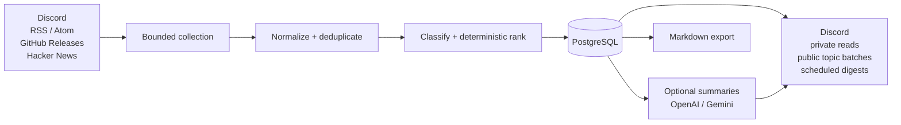

# Signal Radar

[](https://github.com/khsfashi/signal-radar/actions/workflows/ci.yml)
[](https://github.com/khsfashi/signal-radar/actions/workflows/gitleaks.yml)
[](LICENSE)

**A deterministic technology-intelligence pipeline for collecting, ranking, and delivering high-signal AI, game-industry, game-development, software-development, economy, and market news.**

> Collect → normalize → deduplicate → rank → persist → deliver.  
> Optional LLM summarization stays downstream.

Signal Radar is a self-hosted .NET service that turns Discord, RSS/Atom, GitHub Releases, and Hacker News into a durable personal news radar. PostgreSQL is the source of truth and Discord is the primary reading and interaction surface.

The core pipeline does **not** depend on an LLM. Collection, deduplication, classification, ranking, feedback, saved articles, automatic publishing, and digests continue to work when every summary provider is disabled.

<p align="center">
  
</p>
<p align="center"><sub>Signal Radar running in Discord — topic-batched delivery with translated titles, preserved source attribution, and deterministic scores.</sub></p>

## Why Signal Radar exists

Many personal news bots make a provider call during ingestion and treat generated text as the workflow itself. Signal Radar takes the opposite approach: preserve deterministic source data first, then use generative analysis only when it adds value.

| Problem | Design choice | Result |
| --- | --- | --- |
| The same story arrives through multiple sources | Canonical URL normalization plus stable `(source, external_id)` identity | One durable article corpus instead of repeated posts |
| LLM availability, cost, or model changes should not break collection | Deterministic ingestion, classification, and ranking | The radar remains useful with `SUMMARY_PROVIDER=disabled` |
| Discord is convenient UI but poor canonical storage | PostgreSQL is the source of truth | Restarts do not lose ranking, feedback, saves, leases, or delivery state |
| Network and process failures happen around external delivery | Persistent receipts plus expiring ownership leases | Retryable delivery with completed-send deduplication |
| Retrieved article HTML is untrusted | Robots-aware, bounded, public-network-only retrieval by default | Optional summaries without turning ingestion into a crawler |

## System overview



The repository keeps domain rules and application use cases independent from Discord, PostgreSQL, HTTP parsers, and provider adapters:

```text
Domain <- Application <- Infrastructure
                     <- Bot
                     <- Worker
```

See [Architecture](docs/architecture.md) for the detailed flows and dependency boundaries.

## Engineering highlights

- **Deterministic core** — LLM calls are never part of ingestion or ranking.
- **Inspectable ranking** — topic classification and score components are persisted with ranking-profile versions instead of being hidden inside prompts.
- **Durable concurrency** — PostgreSQL constraints, advisory-locked migrations, expiring leases, and `FOR UPDATE SKIP LOCKED` claims coordinate workers safely.
- **Idempotent delivery model** — scheduled digests, Discord ingestion, source polling, and public topic publishing keep persistent receipts or leases.
- **Bounded retrieval** — article extraction validates public targets and redirects, honors robots rules, rejects unsupported content types, and caps bytes, duration, redirects, concurrency, extracted text, and prompt input.
- **Deterministic caches** — normalized article text and structured summaries use SHA-256 identities; immutable summary-cache writes tolerate races.
- **Production-oriented container** — multi-stage build, non-root runtime, read-only root filesystem, `tmpfs`, `no-new-privileges`, health check, graceful cancellation, bounded logs, and secret redaction.
- **Strict builds** — nullable analysis, warnings-as-errors, latest analyzers, code-style enforcement, and deterministic CI builds are enabled centrally.
- **Real integration testing** — CI starts PostgreSQL 17, runs the full Release test suite, collects coverage, builds the production Docker image, and separately scans reachable Git history with Gitleaks.

## What it does

### Collect and normalize

- Ingests allow-listed Discord messages and embeds.
- Polls RSS/Atom feeds, GitHub Releases, and Hacker News.
- Tracks source health, validators, retries, leases, and quarantine state.
- Canonicalizes URLs and deduplicates by URL plus stable external identity.
- Supports runtime RSS/Atom feed administration from Discord.

### Rank and personalize

- Applies deterministic multi-label topic classification.
- Persists source-trust, topic-interest, practical-impact, freshness, and effective ranking data.
- Stores interested, not-interested, hidden, saved, and source-muted state per Discord actor.
- Reclassifies existing articles with the current ranking/topic policy through an admin workflow without rewriting article identity or completed delivery receipts.

### Deliver and read

- Publishes newly collected qualifying articles to configured Discord text, announcement, or Forum destinations.
- Batches public topic delivery instead of posting one message per article.
- Optionally translates titles through the bundled self-hosted LibreTranslate service with PostgreSQL caching and fallback to the original title.
- Provides private `/top`, `/search`, `/saved`, `/export`, `/digest`, `/status`, and `/help` workflows.
- Sends optional public daily and weekly digests with persistent delivery receipts.
- Exports saved links as provider-neutral UTF-8 Markdown.

### Summarize only when requested

- Supports OpenAI Responses and Gemini Generate Content behind one application contract.
- Registers `/summarize` only when a provider is configured.
- Retrieves bounded article excerpts only for explicit summary requests.
- Treats article text as untrusted source material rather than an instruction channel.
- Validates structured provider output locally before caching and rendering it.

## Discord surface

| Workflow | Visibility | Purpose |
| --- | --- | --- |
| `/top`, `/search`, `/saved`, `/export` | Private | Ranked reading, search, saved list, and export |
| `/digest`, `/status`, `/help` | Private | On-demand digest, operational status, command guide |
| `/summarize` | Private | Optional structured AI briefing |
| `관심`, `별로`, `저장`, `숨김` | Private confirmation | Per-user feedback and saved state |
| Automatic topic publishing | Public | New high-scoring articles by topic route |
| Scheduled daily / weekly digest | Public | Shared ranked digest |
| Feed / route administration | Private command response | Runtime source and destination management |
| Source mute / unmute | Private | Per-user source filtering for personal reads |
| `/reclassify` | Admin / manager | Re-evaluate stored article assessments in bounded batches |

<p align="center">
  
</p>
<p align="center"><sub>The in-Discord help surface exposes personal reading, source preferences, runtime feed/route administration, reclassification, digest, and operational status workflows.</sub></p>

Runtime routes are normally managed from Discord. Legacy/bootstrap `DISCORD_TOPIC_CHANNELS` configuration remains supported.

See [Discord interactions](docs/discord-interactions.md) and [Automatic topic publishing](docs/automatic-topic-publishing.md).

## Technology

| Area | Choice |
| --- | --- |
| Runtime | .NET 10 / C# |
| Persistence | PostgreSQL 17 |
| Discord | Discord.Net adapter behind application boundaries |
| Parsing | bounded HTTP + XML/JSON/HTML parsing |
| Translation | self-hosted LibreTranslate, optional at runtime |
| AI summaries | optional OpenAI Responses or Gemini Generate Content |
| Deployment | Docker / Docker Compose |
| CI | GitHub Actions, PostgreSQL integration tests, production image build |
| Supply-chain hygiene | Dependabot + full-history Gitleaks workflow |

## Quick start with Docker Compose

### Requirements

- Windows with WSL 2 / Virtual Machine Platform and Docker Desktop using the WSL 2 engine, or another Docker-capable host
- Git
- A Discord application and bot already invited to the target server

Clone the repository:

```powershell
git clone https://github.com/khsfashi/signal-radar.git
Set-Location signal-radar
```

Create local configuration:

```powershell
Copy-Item .env.example .env
Copy-Item config\feed-sources.starter.json config\feed-sources.json
Copy-Item config\github-repositories.starter.json config\github-repositories.json
Copy-Item config\ranking-profile.example.json config\ranking-profile.json
```

Replace every example password, Discord ID, and token in `.env`. Production startup intentionally rejects placeholder secrets such as `replace-me` and `change-me`.

Validate Compose without printing resolved secrets, then start the stack:

```powershell
docker compose config --quiet
docker compose up -d --build
docker compose ps
docker compose logs --tail=200 worker
```

The default stack runs PostgreSQL, LibreTranslate, and the Signal Radar Worker. PostgreSQL remains internal to the Compose network unless the explicit development override is used.

A healthy Worker startup includes messages similar to:

```text
PostgreSQL migrations and startup health check completed.
Discord inbox gateway started.
Discord commands synchronized for guild ...
Gateway Ready
```

Do **not** run `docker compose down -v` unless you intentionally want to delete the PostgreSQL volume and all Signal Radar data.

For the complete Korean walkthrough, see [Discord 실제 적용 가이드](docs/discord-setup-ko.md). For backup and recovery procedures, see [운영·백업·복구 가이드](docs/operations-ko.md).

## Local development

```bash
dotnet restore SignalRadar.sln
dotnet build SignalRadar.sln --configuration Release --no-restore
dotnet test SignalRadar.sln --configuration Release --no-build
dotnet run --project src/SignalRadar.Worker
```

The .NET process does not automatically load `.env`; export the required variables into the operating-system environment when running outside Compose.

Container or local DB-only health check:

```bash
dotnet run --project src/SignalRadar.Worker -- --healthcheck
```

The CI workflow runs the Release build and full test suite against a real PostgreSQL 17 service before validating the production container image.

## Operational guarantees

Signal Radar deliberately preserves several invariants in PostgreSQL:

- Canonical article URLs are unique.
- Stable source items are unique by `(source, external_id)`.
- Feedback, saved articles, hidden state, and source mutes are actor-scoped.
- Score components and ranking-profile versions remain inspectable.
- Article-content cache entries store bounded normalized text rather than raw HTML.
- Structured summaries are immutable for a deterministic input hash.
- Scheduled digests and automatic topic publications keep durable delivery state.
- Discord ingestion and source polling use expiring tokenized leases.
- SQL migrations are ordered, checksum-verified, and protected by an advisory lock.

A process crash in the narrow interval after an external service accepts a message but before the corresponding PostgreSQL receipt commit can still produce a rare duplicate after lease expiry. The delivery model is designed around durable at-least-once processing rather than claiming impossible exactly-once delivery across independent systems.

## Documentation

| Document | What it covers |
| --- | --- |
| [Architecture](docs/architecture.md) | Boundaries, ingestion, personalized reads, summaries, delivery, persistence, security |
| [Discord setup — Korean](docs/discord-setup-ko.md) | End-to-end Discord installation and configuration |
| [Discord interactions](docs/discord-interactions.md) | Commands, buttons, visibility, scheduled delivery |
| [Automatic topic publishing](docs/automatic-topic-publishing.md) | Public routing, batching, receipts, retries |
| [Operations — Korean](docs/operations-ko.md) | Deployment, backup, recovery, operating procedures |
| [Structured summaries](docs/summaries.md) | Provider contracts, retrieval, validation, caching |
| [Feed sources](docs/feed-sources.md) | RSS/Atom source configuration |
| [External sources](docs/external-sources.md) | GitHub Releases and Hacker News collection |
| [Ranking and feedback](docs/ranking.md) | Deterministic scoring, topics, feedback |
| [Roadmap](docs/roadmap.md) | Completed milestones and deliberate next steps |
| [Contributing](CONTRIBUTING.md) | Local validation and pull-request expectations |
| [Security](SECURITY.md) | Vulnerability reporting and secret handling |

## Project status

The original v0.1 engineering baseline is complete on `main`: collection, deterministic ranking, PostgreSQL persistence, Discord reading and publishing, optional summaries, digest delivery, production containerization, CI, and operational documentation.

Subsequent mainline work has added title translation, batched public delivery, runtime feed and route management, personal source muting, economy/market classification, bounded article reclassification, runtime hardening, and public-repository hygiene.

See the [Roadmap](docs/roadmap.md) for the intentionally deferred work such as event clustering, novelty scoring, momentum analysis, vector search, and a web dashboard.

## License

Signal Radar is available under the [MIT License](LICENSE).
